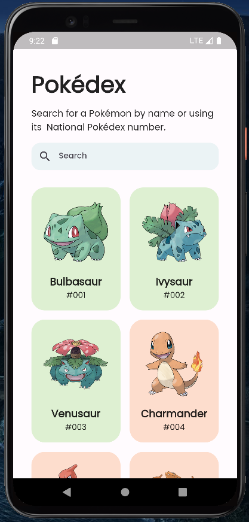
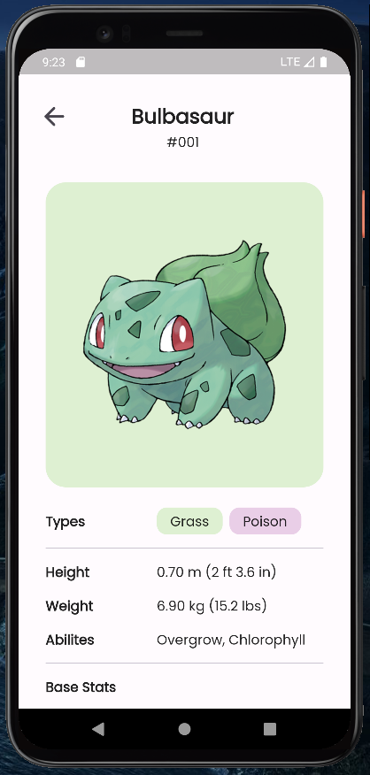

# Pokédex App

Pokédex App to aplikacja, którą napisałem w ramach praktych zawodowych, pomogła mi ona zrozumieć i przyjąć zasady Clean Architecture. Ponadto aplikacja pobieran dane z publicznego API - [POKEAPI](https://pokeapi.co/).

## Screenshots

|  |  |
|:---:|:---:|
|  |  |

## Features

- Wyświetlanie listy pokémonów z zastosowaniem paginacji, by ograniczyć ilość pobieranych danych 
- Po kliknięciu danego elementu zostajemy przeniesieni na ekran ze szczegółami
- Możliwość wyszukiwania pokémonów po ich nazwie lub kodzie

## Tech Stack (packages)

 - **Pobieranie danych z API** - [Http](https://pub.dev/packages/http)
 - **State managment** - [Flutter Bloc](https://pub.dev/packages/flutter_bloc)
 - **Zapisywanie danych lokalnie** - [Hive](https://pub.dev/packages/hive)
 - Equatable, rxdart, dartz
